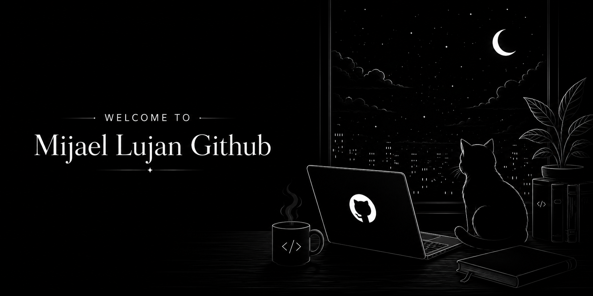

<!--
  ═══════════════════════════════════════════════════════════
  MIJAEL SPACE — README de perfil (v2, grayscale, sin nombre quemado)
  ═══════════════════════════════════════════════════════════
-->

<!--
-->

  

 

### ▪ Connect

 

### ▪ whoami

Aprendí a programar por pura curiosidad y me quedé por la adicción a entender sistemas que nadie más quiere tocar. A veces abro un repo heredado y por un segundo entiendo el vértigo de asomarse a algo que no deberías comprender del todo. Sigo un manual de supervivencia que no escribieron pensando en mí, pero igual funciona. Y cuando algo no compila a las 3 AM, se lo cuento a un pato de goma — nunca me ha delatado.

**Frontend Designer**
 
Next.js / TypeScript
 
Manual de supervivencia: releído más de una vez
 
Debugger profesional de patos de goma
 
Mis servidores casi siempre obedecen
 
Café > Sueño

 

### ▪ Stack

<table>
<tr>
<td align="center">

</td>
<td align="center">

</td>
<td align="center">

</td>
<td align="center">

</td>
</tr>
<tr>
<td align="center">

</td>
<td align="center">

</td>
<td align="center">

</td>
<td align="center">

</td>
</tr>
<tr>
<td align="center">

</td>
<td align="center">

</td>
<td align="center">

</td>
<td align="center">

</td>
</tr>
</table>

 

### ▪ Transmissions

 

**[ 01 ]  🔧Nombre del proyecto uno**

Descripción corta de qué resuelve este proyecto y por qué es interesante o distinto.

`Next.js` `TypeScript` `Postgres`　

**[ 02 ]  🔧Nombre del proyecto dos**

Otra línea explicando el problema que ataca o el reto técnico que tuvo.

`Python` `FastAPI` `Docker`　

**[ 03 ]  🔧Nombre del proyecto tres**

El proyecto que muestras primero cuando alguien pregunta qué haces.

`React` `Node.js` `Redis`　

 

### ▪ Telemetry

 

 

### ▪ Commit Timeline

<picture>
  <source media="(prefers-color-scheme: dark)" srcset="https://raw.githubusercontent.com/Mijael-Lujan-Gandarillas/Mijael-Lujan-Gandarillas/output/github-contribution-grid-snake-dark.svg" />
  <source media="(prefers-color-scheme: light)" srcset="https://raw.githubusercontent.com/Mijael-Lujan-Gandarillas/Mijael-Lujan-Gandarillas/output/github-contribution-grid-snake.svg" />
  
</picture>

 

### ▪ System Status

end_of_transmission_

<!--
  ═══════════════════════════════════════════════════════════
  Pendiente de tu parte: reemplazar 🔧Nombre del proyecto X
  y tu@email.com por datos reales. Todo lo demás ya usa tu
  usuario real (Mijael-Lujan-Gandarillas).
  ═══════════════════════════════════════════════════════════
-->
