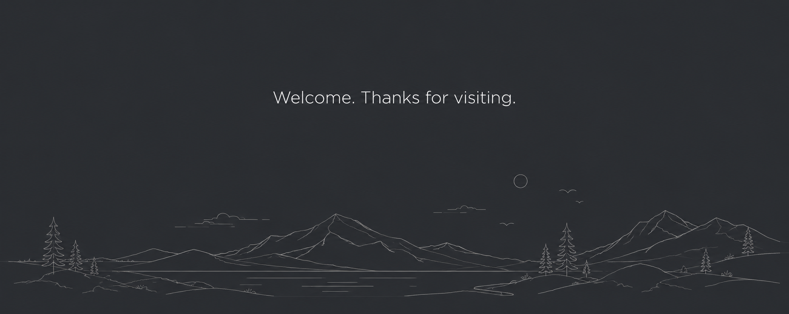
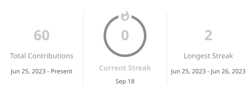

 

### ▪ Connect with me

 

### ▪ whoami

Construyo sistemas, leo más de lo necesario y tengo la mala costumbre de querer entender cómo funciona todo. Me gustan las cosas que tienen una lógica detrás, ideas bien explicadas, el código que envejece con dignidad y esos pequeños detalles que separan algo que simplemente funciona de algo que fue hecho con intención

**Backend lov(s)er**
 
Next.js / TypeScript
 
<i>Pragmatic Programmer</i>
 
API primero, interfaz después
 
HTTP 200 = felicidad
 
La base de datos nunca olvida
 
Café > Sueño
 

 

### ▪ Stack

<table>
<tr>
<td align="center">

</td>
<td align="center">

</td>
<td align="center">

</td>
<td align="center">

</td>
</tr>
<tr>
<td align="center">

</td>
<td align="center">

</td>
<td align="center">

</td>
<td align="center">

</td>
</tr>
<tr>
<td align="center">

</td>
<td align="center">

</td>
<td align="center">

</td>
<td align="center">

</td>
</tr>
</table>

 

### ▪ Projects
<code>git commit -m "last commit?"</code>
 

**[ 01 ]  Gallery**
Galería virtual dedicada a Van Gogh: cada lienzo con su propio espacio para respirar, sin distracciones ni ruido visual.   
`HTML` `CSS` `JavaScript`　   

**[ 02 ]  Wanderlust**
Landing para una agencia que arma tus viajes de punta a punta, pensada para convertir curiosidad en reserva.   
`HTML` `CSS` `JavaScript`　   

**[ 03 ]  MonoForm Homes**
Recreación pixel-perfect de una constructora inglesa brutalista: líneas duras, tipografía sobria, cero adornos innecesarios.   
`HTML` `CSS` `JavaScript`　   

 

### ▪ Telemetry

 

 

### ▪ Commit Timeline

<picture>
  <source media="(prefers-color-scheme: dark)" srcset="https://raw.githubusercontent.com/Mijael-Lujan-Gandarillas/Mijael-Lujan-Gandarillas/output/github-contribution-grid-snake-dark.svg" />
  <source media="(prefers-color-scheme: light)" srcset="https://raw.githubusercontent.com/Mijael-Lujan-Gandarillas/Mijael-Lujan-Gandarillas/output/github-contribution-grid-snake.svg" />
  
</picture>

 

### ▪ System Status

end_of_transmission_

